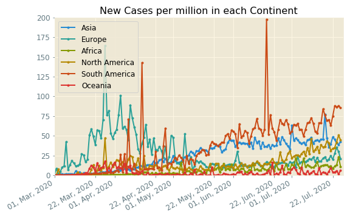
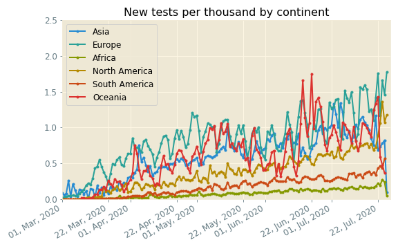
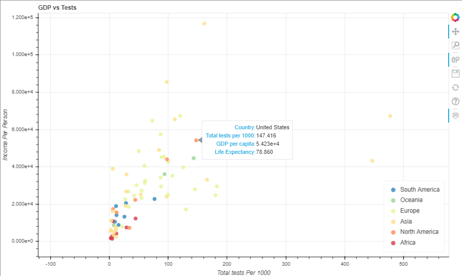
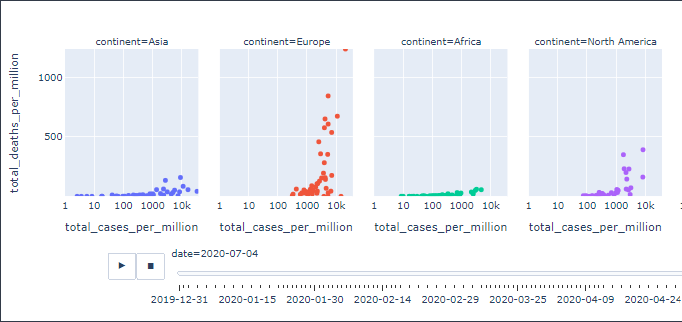

# Enrique_portfolio
A summary of my data science projects

# [Project 1: Data Science Salary Estimator](https://github.com/EnriqueSPR/ds_salary_project)

* Created a tool that estimates data science salaries to help data scientists negotiate their income when they get a job.

* Scraped over 1000 job descriptions from glassdoor using python and selenium.

* Engineered features from the text of each job description to quantify the value companies put on python, excel, aws, and spark.

* Optimized Linear, Lasso, and Random Forest Regressors using GridsearchCV to reach the best model.

* Built a client facing API using flask

# [Project 2: Data Science Price Estimator from Houses in Madrid](https://github.com/EnriqueSPR/house_pricing_madrid)

* Created a tool that estimates prices from Madrid houses which can aid flat owners as well as people looking for a house to get an idea of the Real State Market in Madrid.

* Performed data cleaning steps and removed outliers.

* Exploratory Data Analyses shed light into the most important parameters driving house prices in Spain.These parameters were chosen in the model building process.

* Optimized Linear, Decission Tree, and Random Forest Regressors using GridsearchCV to reach the best model.

* Built a client facing API using flask.

# [Project 3: Data Science Rental Estimator from Houses in Madrid](https://github.com/EnriqueSPR/house_renting_madrid)

* Created a tool that estimates rental prices from Madrid houses which can aid flat owners as well as people looking for a house to get an idea of the Real State Market in Madrid.

* Scraped over 2000 house rent information from https://www.pisos.com/ using python and the beautifulsoup library.

* Performed data cleaning steps and removed outliers.

* Exploratory Data Analyses shed light into the most important parameters driving house prices in Spain. These parameters were chosen in the model building process.

* Optimized Linear, Lasso, Decission Tree, Random Forest, Support Vector Regressors using GridsearchCV to find the best model.

* Wrote a python flask server that uses the saved model to serve http requests.

* Built a website in html, css and javascript that allows user to predict rental prices in Madrid.

# [Project 4: tennis_match_predictor](https://github.com/EnriqueSPR/tennis_match_predictor)

* The goal of this project was to create an algorithm using supervised machine learning to predict the outcome of tennis matches by taking in account information from the players form before the match.

* I scrapped the data from ATP tournaments, matches and players from 1999 to 2020.

* I performed data cleaning steps and feature engineering to create information of the players form at the moment of the upcoming match.

* Exploratory data analyses were carried out to get insight into the features correlation and distribution. This allowed to select the most relevant features for the model.

* I tested diferent algorithms capable of working on this classification problem:

  * Linear Algorithms: Logistic Regression (LR) and Linear Discriminant Analysis (LDA).
  * Nonlinear Algorithms: Classification and Regression Trees (CART), Support Vector Machines (SVM), Gaussian Naive Bayes (NB) and k-Nearest Neighbors (KNN).
  
* Linear Regression models preformed better in this case, and were chosen for further tunning. 

    

# [Project 5: Covid EDA project](https://github.com/EnriqueSPR/Covid_EDA_Project)

In this notebook I focused on analyzing covid data in an effort to better understand the main factors that drive the spread of Covid.

Below I include few highlight figures.

* Plots showing the number of cases per million and the number of tests per 1000 reported in each continent daily:

   

* Plots showing the top 5 countries affected in the world by cumulative cases and deaths every 2 weeks:

   

* Plots showing the death rates, the percentage of population older than 70 and the testing rates by country:

 

* Screenshots of the interactive plots generated with Bokeh and Plotly:

### Conclusions: 
In this exploratory data analysis of Covid Data we have extracted some valuable information on the factors driving the spread and negative impact of this virus:
* Older people seem to be more susceptible to the virus.
* Countries with higher testing rates are controlling better the stread of covid. Scaling-up testing quickly at the beginnnig seems to be a critical factor in order to be able to control the pandemia.
* The pandemia seems to be accelerating in the american continent, where policies have been somewhat more relaxed. The opposite tendecy is taking place in Europe. This comes to show the importance of following the advices from health authorities from the use of the mask, practicing social distancing and washing hands.

