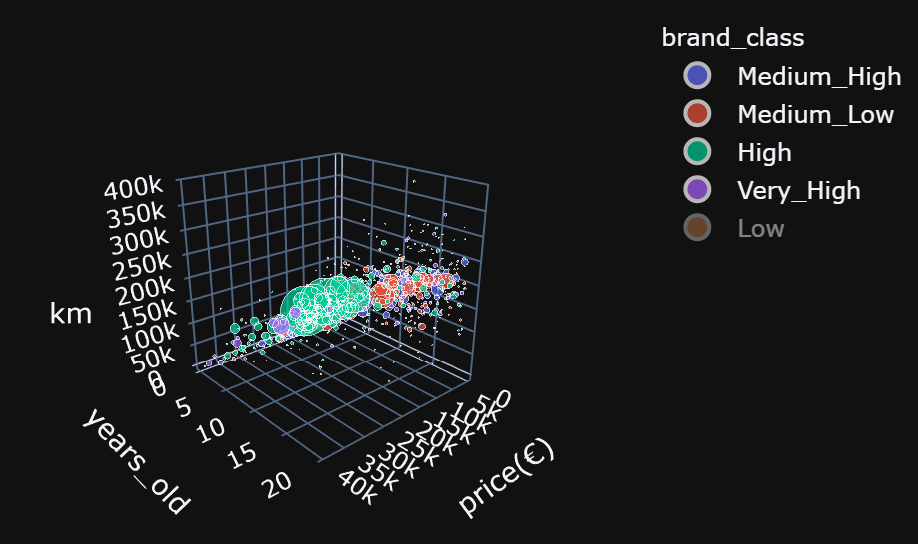
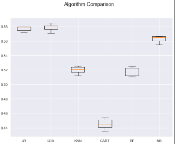

# Enrique_portfolio
A summary of my data science projects.
# [Project 1: Car Prices Estimator](https://github.com/EnriqueSPR/second_hand_cars_project)

Supervised ML **regression problem** -> An end-to-end project in which I scrape , prepare, analyse the data and find a model to predict second hard prices cars in Spain.

[**See published full code here.**](https://nbviewer.jupyter.org/github/EnriqueSPR/second_hand_cars_project/blob/main/car_project.ipynb)

1) **Scraped 40000 second hand cars** from [Milanuncios](https://www.milanuncios.com/coches-de-segunda-mano/?fromSearch=1&orden=relevance&pagina=1). One of the most famous second-hand online pages in Spain. 🚗🚓🚕💨

2) **Cleaned** and **prepared the data**. 🔄

3) **Analyzed the data** to answer questions such, in what cities can we find the best deals? or What models are most popular or reliable? 📈📊

See some highlight pictures below:

* Mapping prices of second hand adds in Spain: area of the circles is proportional to the **number of adds**, whereas the color gives us information of the median **prices**. 

* 3D plot to analyze models popularity, reliability or economy:

4) Trained an algo to **predict the price** of second hand cars. **Score = 0.93**. 💲

# [Project 2: Bike Usage Estimator](https://github.com/EnriqueSPR/Bicycle_Rental_Company)

Supervised ML **regression problem** -> Predicting bike user usage for a bike company.

[**See published full code here.**](https://nbviewer.jupyter.org/github/EnriqueSPR/Bicycle_Rental_Company/blob/master/Bike_count_predictor.ipynb)

**Description**: The aim is to use the [data from the past 10 years](https://www.capitalbikeshare.com/system-data) to develop a model that can predict bicycle usage (Number of trips and total time ride usage) at a given day.

* **Combined and prepared data** into a single file containing the number of trips and total time usage for each day a total period of 10 years.
* Further complemented this data with [weather data](https://kilthub.cmu.edu/articles/dataset/Compiled_daily_temperature_and_precipitation_data_for_the_U_S_cities/7890488)   (temperature and precipitation) 
and [US federal holidays](https://docs.opendata.aws/noaa-ghcn-pds/readme.html).

* **Exploratory Data Analyses** were carried out to study the patterns on bike usage. This allowed to select the most relevant attributes for modelling (See figures below)

* Study **model performace** for a list of algorithms. 
For this cross-validation was performed and negative mean squared error was used as metric of model performance.

* Fine **tuned** the most promissing models by using GridSearchCV. Two models, **GradientBoostRegressor** and **ExtraTreesRegressor**,  were trained to predict the total bike usage and number of trips respectively. Both models achieved a score of **0.90**.

* Created a **pickle** file for the machine learning model.

# [Project 3: Redwine Quality Predictor](https://github.com/EnriqueSPR/red_wine_quality)
Supervised ML **Multi-classification  problem** -> Predicting wine quality

[**See published full code here..**](https://nbviewer.jupyter.org/github/EnriqueSPR/red_wine_quality/blob/master/red_wine.ipynb)

In this project we will tackle a multi-classification problem using supervised ML on a well known dataset about red wine quality. See here. This dataset contains quality parameters for 1596 red-wines, which we can use to build a model that predicts red wine quality (Classifies it on a scale from 0 to 5).

Following analyses of feature distribution and data prepocessing, several classification models were trained and their performance assessed.
Three good performing models(SVC, RFC and ETC) were chosed, tuned and ensembled by using sorf voting classifier.  
This resulted in a balanced model that performed satisfactorily in both the test and training sets.
Below are some images associated to the evaluation of such model against the test set (**0.64 accuracy**).

  * **ROC curves** for classes 2 and 3:
  
  
 
   * Plot bar showing the **feature importance** and the correlation of each attribute with the target:
  
  
 
Lastly, I built a **Neural Network(NN)** to see how it would perform for this particular problem. 
  * As It can be seen in the confussion matrixes below, the ensemble model(left), overall performed better that the NN (Rigth).Nontheless, not a bad job from the NN, considering  that they often show their potential in large datasets.
 
    

# [Project 4: Data Science Rental Estimator from Houses in Madrid](https://github.com/EnriqueSPR/house_renting_madrid)

Supervised ML **regression problem** -> Predicting house rental prices in Madrid

[**See published full code here.**](https://nbviewer.jupyter.org/github/EnriqueSPR/house_renting_madrid/blob/master/model/Madrid_house_rental.ipynb)

* Created a tool that estimates rental prices from Madrid houses which can aid flat owners as well as people looking for a house to get an idea of the Real State Market in Madrid.

* **Scraped over 2000 house rent information** from https://www.pisos.com/ using python and the beautifulsoup library.

* Performed **data cleaning** steps and removed outliers.

* **Exploratory Data Analyses** shed light into the most important parameters driving house prices in Spain. These parameters were chosen in the model building process.

* Optimized Linear, Lasso, Decission Tree, Random Forest, Support Vector Regressors using GridsearchCV to **find the best model**.

* SVR was chosen as the most promissing and tuned using GridSearchCV, achieving a score of **0.84** accuracy against the test set.

* Wrote a python **flask server** that uses the saved model to serve http requests.

* Built a **website** in html, css and javascript that allows user to predict rental prices in Madrid.

# [Project 5: Data Science Salary Estimator](https://github.com/EnriqueSPR/ds_salary_project)

Supervised ML **regression problem** -> Predicting salary of data scientist in USA

[**See published full code here.**](https://nbviewer.jupyter.org/github/EnriqueSPR/prediction_salary_project/blob/master/salary_prediction_project.ipynb)

* Created a tool that estimates data science salaries to help data scientists negotiate their income when they get a job.

* **Scraped** over 1000 job descriptions from glassdoor using python and selenium.

* **Engineered features** from the text of each job description to quantify the value companies put on python, excel, aws, and spark.

* Optimized Linear, Lasso, and Random Forest Regressors using GridsearchCV to reach the **best model(MAE=12.8 with RFR)**.

* Built a client facing **API** using flask

# [Project 6: Data Science Price Estimator from Houses in Madrid](https://github.com/EnriqueSPR/house_pricing_madrid)
Supervised ML **regression problem** -> Predicting house prices in Madrid

[**See published full code here.**](https://nbviewer.jupyter.org/github/EnriqueSPR/house_pricing_madrid/blob/master/Model/house_price_project_removed_outliers.ipynb)

* Created a **tool that estimates prices** from Madrid houses which can aid flat owners as well as people looking for a house to get an idea of the Real State Market in Madrid.

* Performed **data cleaning** steps and removed outliers.

* **Exploratory Data Analyses** shed light into the most important parameters driving house prices in Spain.These parameters were chosen in the model building process.

* Optimized Linear, Decission Tree, and Random Forest Regressors using GridsearchCV to reach the best model (**0.89 for RFR**).

* Built a client facing **API** using flask.

# [Project 7: Tennis Match Predictor](https://github.com/EnriqueSPR/tennis_match_predictor)

Supervised ML **binary classification problem** -> Predicting tennis matches outcome

[**See published full code here.**](https://nbviewer.jupyter.org/github/EnriqueSPR/tennis_match_predictor/blob/master/tennis_p.ipynb)

* The goal of this project was to train an algorithm using supervised machine learning to predict the outcome of tennis matches by taking in account information from the players form before the match.

* I **scrapped the data** from ATP tournaments, matches and players from 1999 to 2020.

* I performed **data cleaning** steps and **feature engineering** to generate information of the players form at the moment of the upcoming match.

* Exploratory data analyses were carried out to get insight into the features **correlation** and **distribution**. This allowed to select the most relevant features for the model.

* I tested diferent algorithms capable of working on this classification problem:

  * **Linear Algorithms**: Logistic Regression (LR) and Linear Discriminant Analysis (LDA).
  * **Nonlinear Algorithms**: Classification and Regression Trees (CART), Support Vector Machines (SVM), Gaussian Naive Bayes (NB) and k-Nearest Neighbors (KNN).
  
* Linear Regression models preformed better in this case, and were chosen for further **tunning**. 

    

# [Project 8: Covid EDA project](https://github.com/EnriqueSPR/Covid_EDA_Project)

In this notebook I focused on analyzing covid data in an effort to better understand the main **factors that drive the spread of this virus** and to forecast the evolution of the pandemia.

[**See published full code here.**](https://nbviewer.jupyter.org/github/EnriqueSPR/covid_EDA_project/blob/master/covid_EDA_project.ipynb)

Below I include few highlight figures.

* Plots showing the top 5 countries affected in the world by cumulative cases and deaths every 2 weeks:

   

* Plots showing the death rates, the percentage of population older than 70 and the testing rates by country:

 

* Screenshots of the interactive plots generated with **Bokeh** and **Plotly**:

# [Project 9: BoardGames EDA project](https://github.com/EnriqueSPR/board_games_EDA_project)

An EDA project in which a board game database is analysed to investigate **what factors drive sales for these products**.

[**See published full code here.**](https://nbviewer.jupyter.org/github/EnriqueSPR/board_games_EDA_project/blob/main/BoardGames.ipynb)

 I aimed to aswer the following questions:
 
 * What games people buy/own the most?
 
   
  
  * What type of games most succesfull companies sell?
  
   
  
  *  What game difficulty people prefer to buy/own?
  
   
  
  * What games have been sold most units?
  
    

Some of the interesting insights we got from these analyses is that **games with a high number of sales** are most likely: 
 * **Card games** 
 * With a **medium level of difficulty**.
 * **High minimum age**
 * With **no time or player restrains**.
 * **Expansions** (Normal, since they are well-stablished games)
